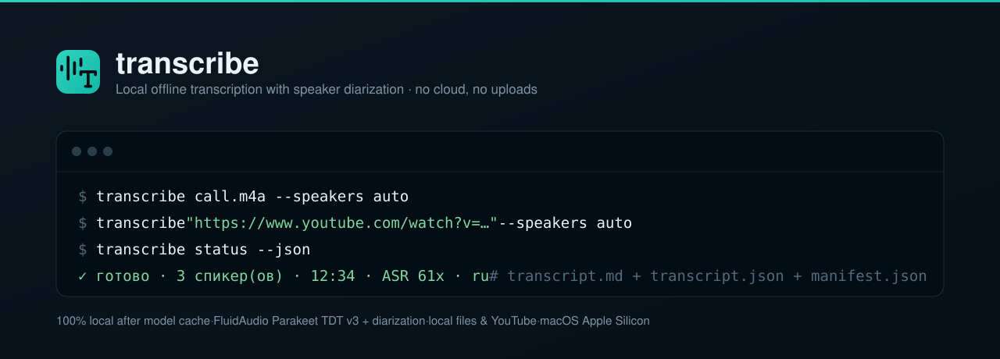

<picture>
  <source media="(prefers-color-scheme: dark)" srcset="docs/assets/readme-banner.svg">
  <source media="(prefers-color-scheme: light)" srcset="docs/assets/readme-banner-light.svg">
  
</picture>

# 🎙️ transcribe — local offline transcription with speaker diarization

[](https://github.com/speech115/transcribe/actions/workflows/ci.yml)
[](https://www.python.org/downloads/)
[](CHANGELOG.md)
[](LICENSE.txt)

A local offline transcription CLI for macOS (Apple Silicon): one command turns
a local audio/video file or a YouTube link into a marked-up transcript with
speaker diarization. ASR runs on the Apple Neural Engine (NVIDIA Parakeet
TDT v3 via FluidAudio) with pyannote-style diarization, vendored as a single
binary — for humans and AI agents alike.

> 100% local after the first-run model cache. No cloud backend, no uploads,
> no API keys, no telemetry. The only network call is `yt-dlp` fetching
> YouTube audio when the source is a YouTube URL.

Skill lineage: this CLI is the engine behind the `transcribe` agent skill
([SKILL.md](SKILL.md)); the run contract lives in one module
([ADR-0002](docs/adr/ADR-0002-run-module.md)) behind one engine seam
([ADR-0001](docs/adr/ADR-0001-engine-seam.md)).

## Contents

[Features](#features) · [Install](#install) · [Quick start](#quick-start) ·
[Documentation](#documentation) · [Configuration](#configuration) ·
[Output](#output) · [Status](#status) · [Contributing](#contributing) ·
[Credits](#credits) · [License](#license)

## Features

- **One command, one run** — `transcribe <source>` is a single foreground
  process: preflight, prepare audio, recognize, diarize, merge, write
  artifacts, exit. No daemons, no background state. Stages
  (`prep` → `asr` → `diar` → `merge`) are traced live in `progress.json`.
- **Batch and watched folders** — pass several sources for sequential batch
  transcription, or use explicit `--watch DIR` polling for dropped media.
- **Clean turns** — `--clean-fillers` removes a conservative language-aware
  list from turns while preserving raw word timings.
- **Speaker diarization** — `--speakers auto` detects the speaker count,
  `--speakers N` forces it, `--speakers off` disables it for monologues.
  Fast streaming mode by default; an offline mode for accuracy.
- **Local files and YouTube** — any file `ffmpeg` can read (m4a, mp3, wav,
  mp4, mov, …) and watch URLs via `yt-dlp`, with output directories named
  from the real video title, never a URL slug.
- **Agent-first artifacts** — `transcript.md` (canonical reading file),
  `transcript.json` (turns + word timings), `manifest.json` (run metadata,
  written last as the commit marker), `progress.json` (live tracing).
- **Language auto-detection** — resolves to `ru` / `en` / `mixed` / `auto`
  (explicit flag → engine answer → text heuristic) and writes the label
  into every artifact.
- **Progress on demand** — `transcribe status` reports a running or finished
  run without tailing logs, with ETA calibrated from the previous run's
  real-time factor.
- **Offline privacy** — after the model cache (≈1–3 GB, first run), every
  run is fully local. Media never leaves the machine.
- **One tested engine seam** — the FluidAudio contract (subprocess, JSON
  schemas, error classification) lives only behind `lib/engine.py`
  ([ADR-0001](docs/adr/ADR-0001-engine-seam.md)); the whole run contract —
  stages, ETA, artifact names, schemas — lives in `lib/run.py`
  ([ADR-0002](docs/adr/ADR-0002-run-module.md)).

## Install

Requires macOS on Apple Silicon, `ffmpeg`/`ffprobe` on PATH, and (for
YouTube) `yt-dlp`:

```bash
brew install ffmpeg
brew install yt-dlp            # only for YouTube sources
```

```bash
git clone https://github.com/speech115/transcribe.git ~/Projects/tools/transcribe
ln -s ~/Projects/tools/transcribe/bin/transcribe ~/bin/transcribe   # put it on PATH
ln -s ~/Projects/tools/transcribe ~/.agents/skills/transcribe       # skill for AI agents
```

The ASR/diarization engine is vendored as a single arm64 binary
(`vendor/fluidaudiocli`) — no separate engine install. The first run
downloads the models (≈1–3 GB) and caches them; after that the tool is
offline.

## Quick start

```bash
# 1. Transcribe a local call
transcribe call.m4a --speakers auto

# 2. Force the speaker count and pick the output directory
transcribe video.mp4 --speakers 2 --out ~/Downloads/transcripts/video

# 3. Transcribe a YouTube video (named by the real video title)
transcribe "https://www.youtube.com/watch?v=…" --speakers auto

# 4. Transcribe several sources sequentially
transcribe call-a.wav call-b.m4a --out-root ~/Downloads/transcripts

# 5. Watch a folder for new media
transcribe --watch ~/Downloads/inbox --out-root ~/Downloads/transcripts

# 6. Watch a run from another terminal
transcribe status
transcribe status --json        # machine-readable
```

Language is auto-detected by default; use `--lang ru` or `--lang en` only
when a specific language is explicitly wanted.

## Documentation

Full guide: **[docs/guide/](docs/guide/README.md)**

| Area | Pages |
| --- | --- |
| **Start** | [overview](docs/guide/overview.md) · [install](docs/guide/install.md) · [quickstart](docs/guide/quickstart.md) |
| **Operation** | [transcribe](docs/guide/transcribe.md) · [output](docs/guide/output.md) · [status](docs/guide/status.md) |
| **Engine** | [engine](docs/guide/engine.md) |
| **Reference** | [ADR index](docs/adr/README.md) · [changelog](CHANGELOG.md) |
| **Agents** | [SKILL.md](SKILL.md) — routing table and recipes · [AGENTS.md](AGENTS.md) — the contract every agent follows here |

## Configuration

There are no config files and no environment variables. Everything is
per-invocation flags:

| Flag | Default | Effect |
| --- | --- | --- |
| `--speakers auto\|off\|N` | `auto` | detect the speaker count, disable diarization, or force N speakers |
| `--lang ru\|en\|auto` | `auto` | force a language or auto-detect |
| `--out DIR` | — | explicit output directory for this run |
| `--out-root DIR` | `~/Downloads/transcripts` | root for default output naming |
| `--clean-fillers` | off | remove conservative filler words from turns; raw words stay unchanged |
| `--watch DIR` | — | poll a folder for stable new media; mutually exclusive with inputs and `--out` |
| `--diar-mode streaming\|offline` | `streaming` | fast diarization, or slower and more accurate |
| `--asr-model v3\|v2` | `v3` | Parakeet model generation |
| `--keep-tmp` | off | keep raw ASR/diarization JSON for debugging |

If neither `--out` nor `--out-root` is given, output goes to
`~/Downloads/transcripts/<title>` — the file name without extension for
local files, the actual video title for YouTube. Existing directories get a
numeric suffix (`call`, `call (2)`, …).

**Exit codes:**

| Code | Meaning |
| --- | --- |
| 0 | success |
| 1 | run error (including any failed source in a batch) |
| 2 | argument parsing error |

## Output

Each run writes three deliverables and a live-tracing file into the output
directory:

- `transcript.md` — canonical reading file: turns by speaker (`S1..Sn`),
  ready for AI agents.
- `transcript.json` — structured turns and raw word timings. With
  `--clean-fillers`, only the turn text is cleaned.
- `manifest.json` — engine, source, duration, RTF, speaker count, cleanup flag,
  and run metadata; written last, so its presence means the run completed.
- `progress.json` — live run tracing, updated every ~2 s and finalized
  `done`/`error`.

For a simple "transcribe this" request, report the `transcript.md` path and
compact metrics from `manifest.json`. Read `transcript.md` only for
follow-up work (summary, cleanup, extraction, QA); use `transcript.json`
only for exact timestamps or programmatic slicing. Details:
[docs/guide/output.md](docs/guide/output.md).

## Status

v0.4, in daily local use. CI runs `pytest` on Linux and macOS for every
push and pull request ([.github/workflows/ci.yml](.github/workflows/ci.yml)).
The suite is pure-stdlib and covers the engine seam, the language resolution
chain, the merge, and the run contract — no engine binary needed.

## Contributing

Welcome — this is a small single-maintainer tool, and [CONTRIBUTING.md](CONTRIBUTING.md)
has the working rules: a bug fix starts from a reproducing test, tests run
against public seams, and documentation duties are part of the change.
[AGENTS.md](AGENTS.md) is the full contract every agent follows here.
Report a privacy or security issue privately via [SECURITY.md](SECURITY.md);
never paste audio contents or transcripts into an issue.

## Credits

- ASR: [NVIDIA Parakeet TDT v3](https://huggingface.co/nvidia/parakeet-tdt-0.6b-v3)
  running on the Apple Neural Engine via [FluidAudio](https://fluidaudio.com/).
- Diarization: FluidAudio pyannote-style speaker diarization.
- YouTube audio: [`yt-dlp`](https://github.com/yt-dlp/yt-dlp).
- Skill contract: conventions from the local agent-skills stack
  ([docs/agents/](docs/agents/)).

## Maintainers

- [@speech115](https://github.com/speech115)

## License

[Apache-2.0](LICENSE.txt) © speech115. Parakeet and pyannote models ship
under their own licenses via FluidAudio; this tool is not affiliated with
NVIDIA, FluidAudio, or YouTube.
